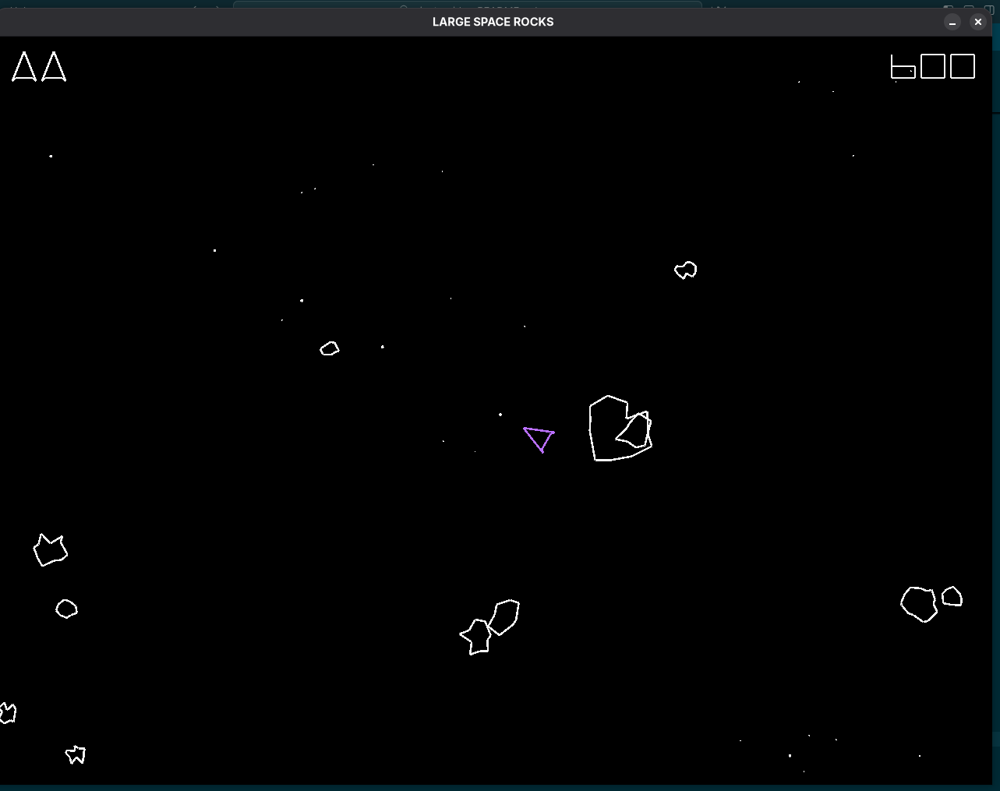

# Zigsteroids

A Zig implementation of the classic Asteroids game. This is a smallish but fun zig project that is useful for showing the migration of the project
from zig-0.11 to zig-0.15.



The original project is at:
- https://github.com/jdah/zigsteroids.git

It was mainly written on jdah's live stream on stream 16/March 2024 
- https://www.youtube.com/watch?v=ajbYYgbDXGk

This project is a fork and modification of the original, with additional features and improvements.

## Building

This project currently supports zig-0.11 through zig-0.15.

### Pull dependent raylib-zig submodule

The git submodule is needed for zig-0.11 only. From zig-0.14 onwards, raylib-zig is included as a dependency and thus this step is unnecessary.

```bash
git submodule update --init --recursive
```

### Build

```bash
zig build
```
or

```bash
make init
make run
```


## Running

```bash
zig build run
```

## Controls

- Arrow keys to move and rotate
- Space to fire
- R to restart

## Features

- Ship movement and rotation
- Shooting mechanics
- Asteroid destruction and splitting
- Score tracking
- Game over and restart functionality

## License

MIT
