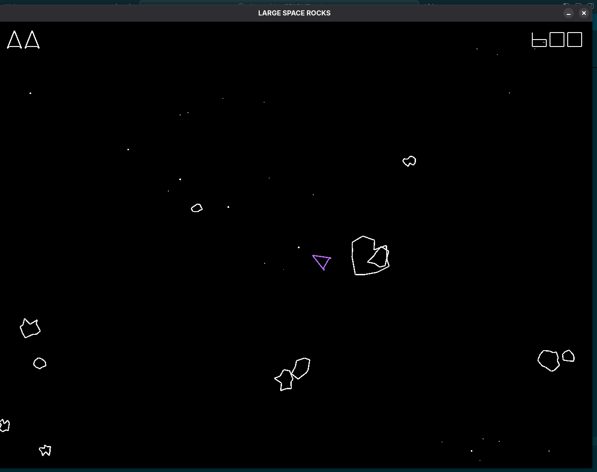

# Zigsteroids

A Zig implementation of the classic 1979 Atari arcade game **Asteroids** -- or as the title screen calls it, _LARGE SPACE ROCKS_.



Forked from [jdah/zigsteroids](https://github.com/jdah/zigsteroids), originally written live on stream 16/March 2024 ([YouTube](https://www.youtube.com/watch?v=ajbYYgbDXGk)). This version adds alien enemies, sound effects, bonus lives, quantum rematerialization (ship phases in after death), and compatibility with Zig 0.11 through 0.15.

## Features

- Ship movement, rotation, and thrust with drag
- Shooting with recoil
- Asteroid destruction and splitting (BIG -> MEDIUM -> SMALL)
- Alien saucers (BIG and SMALL) that shoot back at you
- Particle effects (line debris and dot explosions)
- Sound effects (shoot, thrust, asteroid hit, explosion, heartbeat bloop)
- Score tracking and bonus lives every 10,000 points
- Quantum rematerialization -- your ship phases in with a color shift after respawn
- Wrapping playfield (toroidal topology)
- Difficulty scales with score (more asteroids, faster bloop heartbeat)

## Controls

| Key       | Action        |
|-----------|---------------|
| Left/Right| Rotate ship   |
| Up        | Thrust        |
| Space     | Fire          |
| R         | Restart game  |

## Requirements

- [Zig](https://ziglang.org/download/) 0.14+ (0.15.2 recommended; the `zig-0.15` branch tracks latest)
- raylib (built automatically via the [raylib-zig](https://github.com/raylib-zig/raylib-zig) dependency)
- System development libraries for raylib's backend (GLFW, OpenGL, audio)

## Installing Zig

We recommend using [ZVM (Zig Version Manager)](https://github.com/tristanisham/zvm) to install and manage Zig versions. ZVM makes it easy to install, switch between, and update multiple Zig releases -- handy when different projects require different versions.

For alternative installation methods (direct download, package managers, building from source), see the [Zig Getting Started](https://ziglang.org/learn/getting-started/) page and the [Zig Downloads](https://ziglang.org/download/) page.

### Install ZVM

```bash
curl https://www.zvm.app/install.sh | bash
```

This installs ZVM to `~/.zvm/self` and adds `~/.zvm/bin` to your `$PATH`. Restart your shell (or source your profile) after installation:

```bash
source ~/.profile   # or source ~/.bashrc, etc.
```

Verify ZVM is working:

```bash
zvm --version
```

For more details, see the [ZVM GitHub repository](https://github.com/tristanisham/zvm).

### Install Zig via ZVM

```bash
# Install the latest Zig 0.15.x
zvm install 0.15

# Or install a specific version
zvm install 0.15.2

# Switch to it
zvm use 0.15

# Verify
zig version
```

ZVM supports version shorthand (`.15` resolves to the latest 0.15.x patch) and aliases (`stable` for the latest stable release, `master` for nightly builds). See the [ZVM README](https://github.com/tristanisham/zvm#how-to-use-zvm) for the full command reference.

You can also install ZLS (Zig Language Server) alongside Zig:

```bash
zvm install --zls 0.15
```

## Installing System Dependencies

raylib-zig compiles raylib from source during the Zig build, but raylib itself depends on system libraries for windowing (GLFW), OpenGL, and audio (ALSA/PulseAudio).

### Fedora

```bash
sudo dnf install -y \
    glfw-devel \
    mesa-libGL-devel \
    mesa-libGLU-devel \
    libX11-devel \
    libXrandr-devel \
    libXinerama-devel \
    libXi-devel \
    libXcursor-devel \
    libxcrypt-compat \
    alsa-lib-devel \
    pulseaudio-libs-devel
```

### Ubuntu

```bash
sudo apt install -y \
    libglfw3-dev \
    libgl1-mesa-dev \
    libglu1-mesa-dev \
    libx11-dev \
    libxrandr-dev \
    libxinerama-dev \
    libxi-dev \
    libxcursor-dev \
    libasound2-dev \
    libpulse-dev
```

## Building

```bash
git clone git@github.com:rseward/zigsteroids.git
cd zigsteroids
git checkout zig-0.15   # recommended branch

zig build
```

The executable is output to `zig-out/bin/lsr`.

## Running

```bash
zig build run
```

Or run the built binary directly:

```bash
./zig-out/bin/lsr
```

## Raspberry Pi recommended self build

On a Raspberry Pi 5 (or Pi 500 Plus) running **Raspberry Pi OS Bookworm**, the
default desktop is **Wayland** (the `labwc` compositor), and the GPU is driven by
the `vc4-kms-v3d` (V3D) driver. Building and running on the Pi itself works well
-- the cross-compiled binary plays smoothly even with a field full of rocks --
but the **default build options need adjusting** for this platform:

- raylib's default **X11/GLX** backend fails under Xwayland with
  `GLX: Failed to create context: GLXBadFBConfig`.
- Switching to the **Wayland** backend fixes windowing, but raylib's default
  **desktop OpenGL** then fails at EGL context creation with
  `EGL: Failed to create context: Arguments are inconsistent`, because the V3D
  driver exposes **OpenGL ES** via EGL.

The fix is to build raylib with the **Wayland** display backend and **OpenGL ES
3**. The project's `build.zig` exposes both as build options:
`-Dlinux_display_backend` and `-Dopengl_version`.

### 1. Install Zig

Install the **aarch64** build of Zig 0.15.2 on the Pi (ZVM works on aarch64 too,
or download the tarball directly):

```bash
wget https://ziglang.org/download/0.15.2/zig-linux-aarch64-0.15.2.tar.xz
tar xf zig-linux-aarch64-0.15.2.tar.xz
export PATH="$PWD/zig-linux-aarch64-0.15.2:$PATH"   # or use zvm
zig version   # -> 0.15.2
```

### 2. Install the system dependencies

The X11/GL dev headers plus the Wayland/EGL/GLES dev headers raylib needs:

```bash
sudo apt update
sudo apt install -y \
    libx11-dev libxext-dev libxrandr-dev libxinerama-dev \
    libxi-dev libxcursor-dev libxfixes-dev libxrender-dev libgl-dev \
    libwayland-dev libxkbcommon-dev wayland-protocols libegl-dev libgles-dev
```

### 3. Get the source and build

```bash
git clone git@github.com:rseward/zigsteroids.git
cd zigsteroids
git checkout zig-0.15

zig build -Dlinux_display_backend=wayland -Dopengl_version=gles_3 --release=fast
```

This compiles raylib with the Wayland/EGL backend and OpenGL ES 3, producing an
aarch64 executable at `zig-out/bin/lsr`. (For a debug build, drop
`--release=fast`.)

### 4. Run it

Run the binary **from the project directory** so it can find the `resources/`
sound files:

```bash
./zig-out/bin/lsr
```

You should see it initialize the V3D GPU, e.g.:

```
INFO: GL: OpenGL device information:
INFO:     > Vendor:   Broadcom
INFO:     > Renderer: V3D 7.1.10.2
```

> Note: Wayland does not let applications set their own window position, so you
> will see benign `Wayland: The platform does not support setting the window
> position` warnings from GLFW. The window is created and works fine.

### Cross-compiling instead (optional)

If you'd rather build the aarch64 binary on another machine and copy it to the
Pi, the cross-compile tooling lives in `arm/Makefile` (run it from the project
root):

```bash
make -f arm/Makefile pi-sysroot PI_HOST=pi@<pi-ip>            # one-time: pull a sysroot
make -f arm/Makefile build-pi5 DISPLAY_BACKEND=wayland OPENGL_VERSION=gles_3
scp zig-out/bin/lsr pi@<pi-ip>:~/zigsteroids/
```

The resulting binary runs identically on the Pi.

## Project Structure

```
.
├── build.zig              # Build configuration
├── build.zig.zon          # Package manifest (raylib-zig dependency)
├── src/
│   └── main.zig           # All game logic (~920 lines)
├── resources/
│   ├── bloop_lo.wav        # Heartbeat low tone
│   ├── bloop_hi.wav        # Heartbeat high tone
│   ├── shoot.wav           # Player shot
│   ├── thrust.wav          # Engine thrust
│   ├── asteroid.wav        # Asteroid destruction
│   └── explode.wav         # Ship explosion
├── screenshots/
│   └── zigsteroids.png     # Screenshot for README
├── docs/
│   ├── zig-0_14-migration.md
│   └── zig-0_15-migration.md
├── Makefile               # Convenience targets (init, run, deps)
├── LICENSE                 # MIT (Copyright 2020 jdah)
└── RELEASE.md              # Release notes
```

## Zig Version Compatibility

| Branch      | Zig Version | Notes                                          |
|-------------|-------------|-------------------------------------------------|
| `main`      | 0.11        | Original port, uses git submodule for raylib-zig|
| `zig-0.14`  | 0.14        | Migrated to Not-Nik/raylib-zig fork             |
| `zig-0.15`  | 0.15.2      | Official raylib-zig, `b.createModule()` API      |

See `docs/zig-0_14-migration.md` and `docs/zig-0_15-migration.md` for migration details.

## License

MIT -- see [LICENSE](LICENSE).